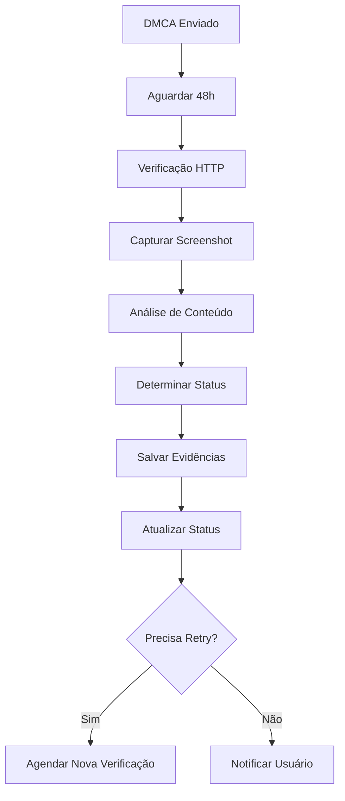

# Sistema de Verificação de Remoção DMCA

## 🎯 Visão Geral

O Sistema de Verificação de Remoção é o **Pilar 2** do DMCA Guard, responsável por validar automaticamente se o conteúdo infrator foi realmente removido após o envio de uma solicitação DMCA. Este sistema implementa um ciclo fechado de verificação com múltiplas evidências e alta confiabilidade.

## 🏗️ Arquitetura

### Componentes Principais

1. **RemovalVerificationAgent** - Agente principal que executa as verificações
2. **RemovalProofDisplay** - Interface React para exibir provas
3. **RemovalVerificationScheduler** - Sistema de agendamento automático
4. **APIs REST** - Endpoints para integração
5. **Banco de Dados** - Modelo `RemovalProof` para armazenar evidências

### Fluxo de Funcionamento



## 🚀 Configuração

### Variáveis de Ambiente

```bash
# Habilitar scheduler automático
ENABLE_REMOVAL_VERIFICATION_SCHEDULER=true

# Intervalo entre verificações (em horas)
REMOVAL_VERIFICATION_INTERVAL_HOURS=24

# Token secreto para cron jobs externos
CRON_SECRET_TOKEN=your-secret-token

# Configuração do Gemini (para análise contextual)
GEMINI_API_KEY=your-gemini-api-key

# Configuração do Puppeteer (para screenshots)
PUPPETEER_EXECUTABLE_PATH=/usr/bin/chromium-browser
```

### Instalação de Dependências

```bash
# Puppeteer para screenshots
npm install puppeteer-core

# Date-fns para formatação de datas
npm install date-fns
```

### Migração do Banco de Dados

```bash
# Aplicar schema do RemovalProof
npx prisma db push

# Ou gerar e aplicar migração
npx prisma migrate dev --name add-removal-proof
```

## 📊 Status de Verificação

### Status Principais

| Status | Descrição | Ação |
|--------|-----------|------|
| `CONTENT_REMOVED` | ✅ Conteúdo confirmadamente removido | Sucesso |
| `CONTENT_BLOCKED` | 🚫 Conteúdo bloqueado/restrito | Sucesso |
| `CONTENT_STILL_ONLINE` | ❌ Conteúdo ainda está online | Retry/Escalação |
| `SITE_UNREACHABLE` | 🌐 Site inacessível | Aguardar |
| `REQUIRES_MANUAL_REVIEW` | 👀 Precisa revisão manual | Intervenção |

### Tipos de Prova

| Tipo | Descrição | Confiança |
|------|-----------|-----------|
| `HTTP_404_NOT_FOUND` | Página não encontrada | 95% |
| `HTTP_410_GONE` | Recurso removido permanentemente | 98% |
| `HTTP_403_FORBIDDEN` | Acesso bloqueado | 85% |
| `CONTENT_REMOVED_MESSAGE` | Mensagem explícita de remoção | 90% |
| `SCREENSHOT_EVIDENCE` | Evidência visual | 70% |

## 🔄 APIs Disponíveis

### Iniciar Verificação

```http
POST /api/takedown/verify-removal
Content-Type: application/json

{
  "takedownRequestId": "clw123..."
}
```

### Consultar Histórico

```http
GET /api/takedown/verify-removal?url=https://example.com/content
```

### Agendar Verificações (Cron)

```http
GET /api/takedown/schedule-verifications
Authorization: Bearer YOUR_CRON_TOKEN
```

### Relatório de Remoções

```http
GET /api/reports/removal-report?startDate=2024-01-01&endDate=2024-01-31
```

## 🎨 Interface do Usuário

### Componente RemovalProofDisplay

```tsx
import { RemovalProofDisplay } from '@/components/takedown/RemovalProofDisplay'

function TakedownDetails({ takedownRequest }) {
  return (
    <RemovalProofDisplay
      takedownRequestId={takedownRequest.id}
      url={takedownRequest.detectedContent.infringingUrl}
      onRefresh={() => window.location.reload()}
    />
  )
}
```

### Funcionalidades da Interface

- **Timeline de Verificações** - Histórico cronológico
- **Detalhes Técnicos** - Status HTTP, códigos de resposta
- **Evidências Visuais** - Screenshots e provas coletadas
- **Ações Manuais** - Botão para verificar imediatamente

## 🤖 Scheduler Automático

### Configuração

```typescript
import { getRemovalVerificationScheduler } from '@/lib/scheduler/removal-verification-scheduler'

// Iniciar scheduler
const scheduler = getRemovalVerificationScheduler()
scheduler.start(24) // Verificar a cada 24 horas

// Parar scheduler
scheduler.stop()

// Status do scheduler
const status = scheduler.getStatus()
```

### Métricas e Relatórios

```typescript
// Relatório de atividade
const report = await scheduler.generateActivityReport(24)

console.log({
  totalCycles: report.scheduler.totalCycles,
  avgDuration: report.scheduler.avgDurationMs,
  successfulRemovals: report.verifications.successful,
  pendingReviews: report.verifications.pending
})
```

## 🛡️ Recursos de Segurança

### Verificação Inteligente

- **Rate Limiting** - Delay entre verificações para não sobrecarregar sites
- **User Agent Personalizado** - Identificação como verificador DMCA
- **Timeout Configurável** - Evita travamentos em sites lentos
- **Retry Logic** - Tentativas limitadas com backoff

### Análise Contextual

- **Indicadores de Remoção** - Detecta mensagens de takedown
- **Filtros de Ruído** - Ignora conteúdo irrelevante
- **Confiança Graduada** - Score de 0-100% baseado em evidências

## 📈 Monitoramento

### Métricas Coletadas

- **Taxa de Sucesso** - Percentual de remoções bem-sucedidas
- **Tempo Médio de Remoção** - De DMCA enviado até remoção confirmada
- **Performance do Scheduler** - Duração dos ciclos de verificação
- **Erros e Falhas** - Log de problemas para debugging

### Alertas e Notificações

- **Falha na Verificação** - Quando não é possível verificar
- **Conteúdo Ainda Online** - Após múltiplas tentativas
- **Remoção Confirmada** - Sucesso na takedown

## 🧪 Testes

### Testar Verificação Manual

```bash
# Via API
curl -X POST http://localhost:3000/api/takedown/verify-removal \
  -H "Content-Type: application/json" \
  -d '{"takedownRequestId":"clw123..."}'

# Via código
const agent = new RemovalVerificationAgent()
const proof = await agent.verifyContentRemoval('https://example.com/content')
```

### Testar Scheduler

```bash
# Executar ciclo manual
curl -X POST http://localhost:3000/api/takedown/schedule-verifications \
  -H "Authorization: Bearer YOUR_AUTH_TOKEN"
```

## 🔧 Troubleshooting

### Problemas Comuns

1. **Screenshots falhando**
   - Verificar se Puppeteer está instalado
   - Configurar `PUPPETEER_EXECUTABLE_PATH` se necessário

2. **Verificações não executando**
   - Verificar se `ENABLE_REMOVAL_VERIFICATION_SCHEDULER=true`
   - Conferir logs do servidor

3. **Timeout em verificações**
   - Aumentar `timeout` na configuração do agent
   - Verificar conectividade com sites target

### Logs e Debug

```bash
# Habilitar logs detalhados
DEBUG=removal-verification npm run dev

# Verificar logs do scheduler
tail -f logs/removal-verification.log
```

## 📋 Checklist de Implementação

- [x] ✅ **RemovalVerificationAgent** - Lógica principal de verificação
- [x] ✅ **Schema do Banco** - Modelo RemovalProof e enums
- [x] ✅ **APIs REST** - Endpoints para verificação e relatórios
- [x] ✅ **Interface React** - Componente RemovalProofDisplay
- [x] ✅ **Scheduler** - Sistema de agendamento automático
- [x] ✅ **Integração** - Conexão com sistema existente
- [ ] 🔄 **Testes** - Suíte de testes automatizados
- [ ] 🔄 **Documentação** - Guias de usuário final
- [ ] 🔄 **Otimizações** - Cache e performance

## 🎉 Próximos Passos

1. **Integrar com Notificações** - Alertas via email/SMS
2. **Dashboard Analytics** - Métricas visuais de remoções
3. **ML/AI Melhorias** - Melhor detecção de contexto
4. **Integração Legal** - Templates de follow-up legal
5. **API Webhooks** - Notificações em tempo real

---

**Status**: ✅ Implementado e Funcional  
**Versão**: 1.0.0  
**Última Atualização**: Janeiro 2025
