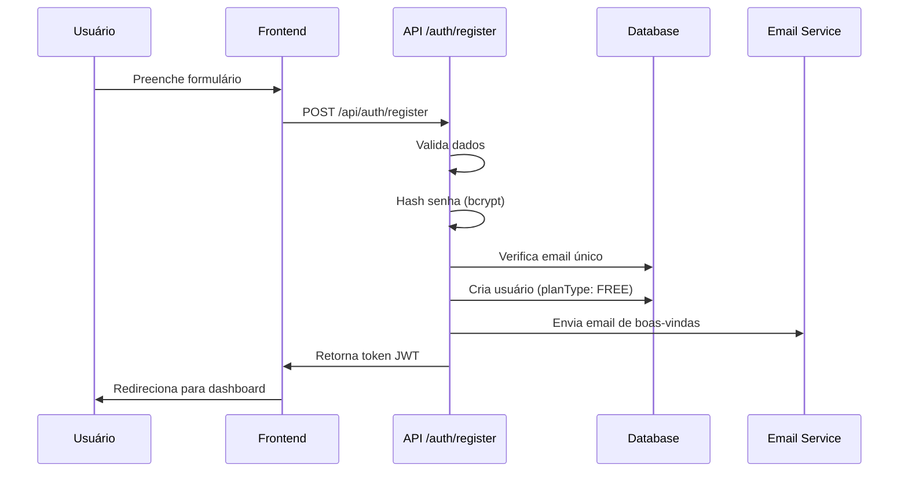
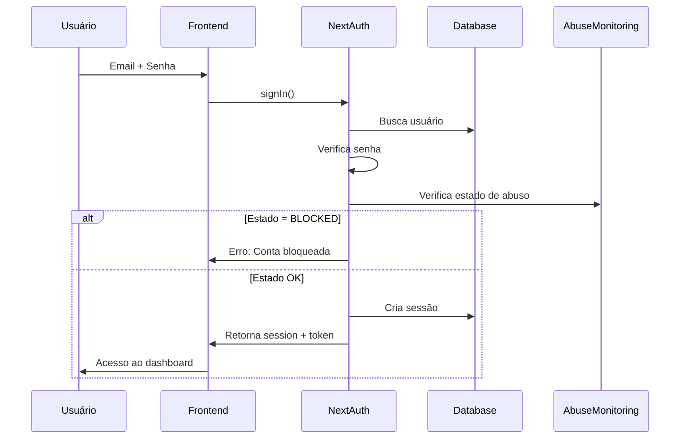
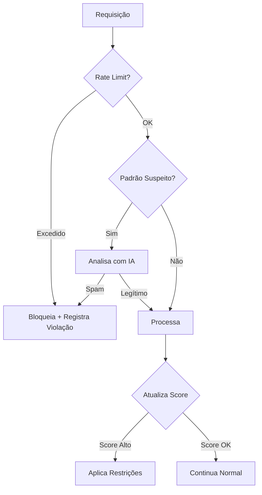
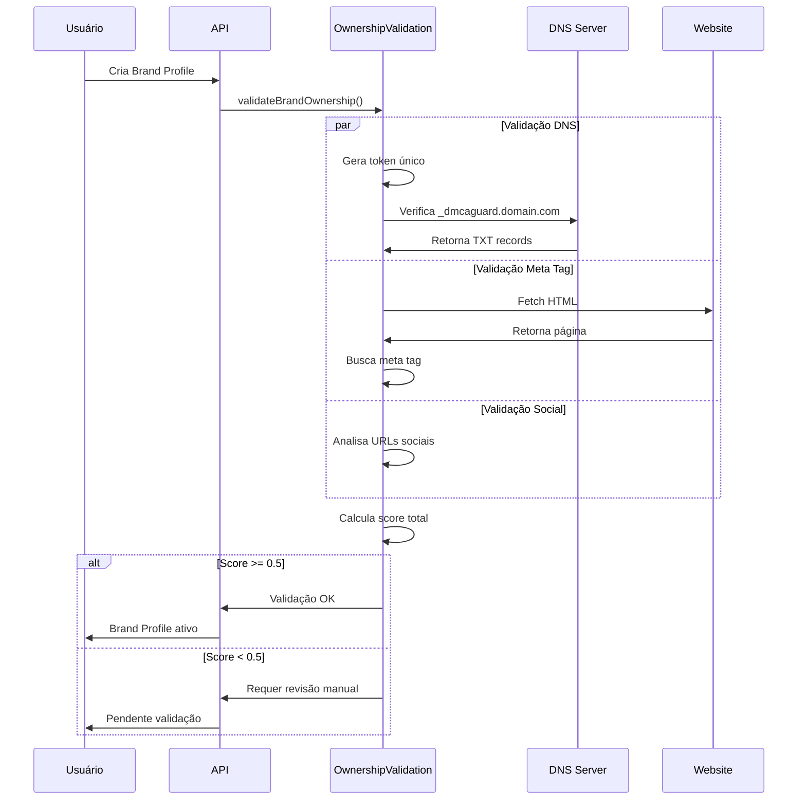
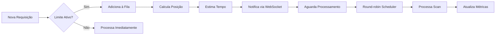
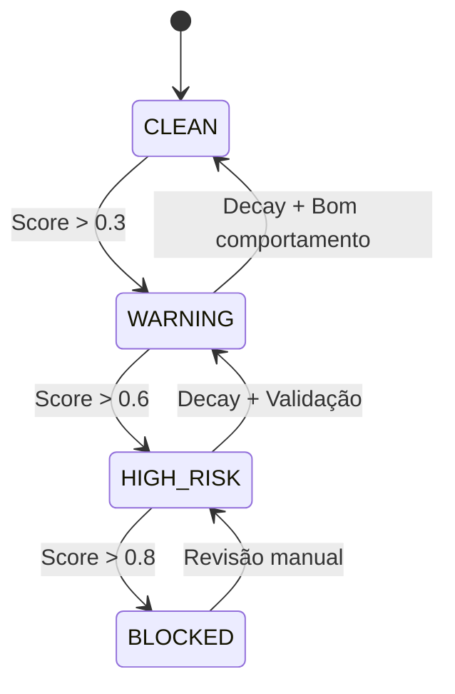

# Fluxos de Segurança - DMCA Guard Platform

Este documento detalha todos os fluxos de segurança implementados na plataforma DMCA Guard, incluindo autenticação, autorização, prevenção de abuso e validação de propriedade.

## Índice

1. [Arquitetura de Segurança](#arquitetura-de-segurança)
2. [Fluxo de Autenticação](#fluxo-de-autenticação)
3. [Sistema de Autorização](#sistema-de-autorização)
4. [Sistema Anti-Abuse em Camadas](#sistema-anti-abuse-em-camadas)
5. [Validação de Propriedade](#validação-de-propriedade)
6. [Rate Limiting e Fair Queue](#rate-limiting-e-fair-queue)
7. [Monitoramento e Detecção](#monitoramento-e-detecção)
8. [Resposta a Incidentes](#resposta-a-incidentes)
9. [Integração com Middlewares](#integração-com-middlewares)
10. [Troubleshooting](#troubleshooting)

## Arquitetura de Segurança

```
┌─────────────────────────────────────────────────────────────┐
│                        Cliente (Browser)                      │
└─────────────────────┬───────────────────────────────────────┘
                      │
┌─────────────────────▼───────────────────────────────────────┐
│                    Edge Middleware                           │
│  • Rate Limiting (IP-based)                                  │
│  • Assinatura de Requisições                                │
│  • Headers de Segurança                                      │
└─────────────────────┬───────────────────────────────────────┘
                      │
┌─────────────────────▼───────────────────────────────────────┐
│                 Application Middleware                       │
│  • Autenticação (NextAuth)                                  │
│  • Detecção de Abuso                                        │
│  • Validação de Sessão                                      │
└─────────────────────┬───────────────────────────────────────┘
                      │
┌─────────────────────▼───────────────────────────────────────┐
│                   Camada de Serviços                        │
│  • OwnershipValidationService                               │
│  • AntiFloodingService                                      │
│  • AbuseMonitoringService                                   │
│  • FairQueueManager                                         │
└─────────────────────┬───────────────────────────────────────┘
                      │
┌─────────────────────▼───────────────────────────────────────┐
│                    Banco de Dados                            │
│  • Logs de Auditoria                                        │
│  • Scores de Abuso                                          │
│  • Validações de Propriedade                                │
└─────────────────────────────────────────────────────────────┘
```

## Fluxo de Autenticação

### 1. Registro de Novo Usuário



### 2. Login



### 3. Verificação de Sessão

Todas as requisições protegidas passam por:

```typescript
// middleware.ts
import { checkAbuseState } from '@/lib/auth-helpers'

export async function middleware(request: NextRequest) {
  const token = await getToken({ req: request })
  
  if (!token) {
    return NextResponse.redirect('/auth/login')
  }
  
  // Verificar estado de abuso
  const abuseState = await checkAbuseState(token.sub)
  if (abuseState === 'BLOCKED') {
    return NextResponse.redirect('/suspended')
  }
  
  return NextResponse.next()
}
```

## Sistema de Autorização

### Níveis de Acesso por Plano

| Recurso | FREE | BASIC | PREMIUM | ENTERPRISE | SUPER_USER |
|---------|------|-------|---------|------------|------------|
| Perfis de Marca | 1 | 3 | 10 | Ilimitado | Ilimitado |
| Keywords/hora | 50 | 200 | 1000 | 5000 | Ilimitado |
| Scans Simultâneos | 1 | 3 | 10 | 50 | Ilimitado |
| Validação de Propriedade | ✓ | ✓ | ✓ | ✓ | Skip |
| API Access | ✗ | ✗ | ✓ | ✓ | ✓ |

### Verificação de Permissões

```typescript
// Exemplo de verificação em API route
import { checkPlanLimit } from '@/lib/auth-helpers'

export async function POST(request: NextRequest) {
  const session = await getServerSession(authOptions)
  
  // Verificar autenticação
  if (!session) {
    return NextResponse.json({ error: 'Unauthorized' }, { status: 401 })
  }
  
  // Verificar plano
  const canCreateProfile = await checkPlanLimit(
    session.user.id,
    'BRAND_PROFILE_CREATE'
  )
  
  if (!canCreateProfile) {
    return NextResponse.json({ 
      error: 'Plan limit reached' 
    }, { status: 403 })
  }
  
  // Continuar com operação...
}
```

## Sistema Anti-Abuse em Camadas

### Camada 1: Rate Limiting (Edge)

```typescript
// lib/middleware/rate-limit-edge.ts
const limits = {
  FREE: { requests: 100, window: '1h' },
  BASIC: { requests: 500, window: '1h' },
  PREMIUM: { requests: 2000, window: '1h' },
  ENTERPRISE: { requests: 10000, window: '1h' }
}
```

### Camada 2: Detecção de Padrões

O `AbuseMonitoringService` detecta:

1. **Spam de Keywords**
   - Múltiplas keywords similares
   - Keywords sem sentido (gibberish)
   - Repetição excessiva

2. **Comportamento Suspeito**
   - Múltiplas contas do mesmo IP
   - Tentativas de burlar validação
   - Monitoramento de concorrentes

3. **Abuso de API**
   - Scraping automatizado
   - Requisições em burst
   - Bypass de rate limits

### Camada 3: Sistema de Score

```
Score de Abuso = Σ(violação × peso) - (tempo × decay)

Estados:
- CLEAN (0-0.3): Normal
- WARNING (0.3-0.6): Monitorado
- HIGH_RISK (0.6-0.8): Restrito
- BLOCKED (0.8+): Bloqueado
```

### Fluxo de Detecção



## Validação de Propriedade

### Métodos de Validação

1. **DNS TXT Record**
   ```
   _dmcaguard.example.com IN TXT "dmca-guard-verification=TOKEN"
   ```

2. **Meta Tag HTML**
   ```html
   <meta name="dmca-guard-verification" content="TOKEN" />
   ```

3. **Verificação de Redes Sociais**
   - Análise de URLs de perfis
   - Verificação de domínios correspondentes

### Fluxo Completo



### Cálculo de Score

```
Score Final = (DNS × 1.0 + MetaTag × 0.9 + Social × 0.7) / 3

Onde:
- DNS: 1.0 se válido, 0 se não
- MetaTag: 0.9 se válido, 0 se não  
- Social: 0.7 × (perfis_válidos / total_perfis)
```

## Rate Limiting e Fair Queue

### FairQueueManager

O sistema garante processamento justo entre usuários:

1. **Fila por Usuário**: Cada usuário tem sua própria fila
2. **Round-robin**: Alterna entre usuários para evitar monopolização
3. **Prioridade por Plano**: Planos superiores têm prioridade maior
4. **Estimativa Inteligente**: Usa histórico real para prever tempos

### Fluxo de Enfileiramento



### Métricas de Performance

O sistema coleta e usa métricas reais:

```typescript
interface ProcessingMetrics {
  averageTime: number      // Tempo médio dos últimos 50 scans
  totalScans: number       // Total processado
  lastUpdated: Date        // Última atualização
}

// Tempos médios por plano (ms)
FREE: 180000       // 3 minutos
BASIC: 150000      // 2.5 minutos  
PREMIUM: 120000    // 2 minutos
ENTERPRISE: 90000  // 1.5 minutos
SUPER_USER: 60000  // 1 minuto
```

## Monitoramento e Detecção

### Jobs Automatizados

1. **Abuse Monitoring Job** (Hourly)
   ```typescript
   - Aplicar decay temporal aos scores
   - Detectar padrões entre contas
   - Gerar alertas para admins
   ```

2. **Cache Cleanup Job** (Every 15 min)
   ```typescript
   - Limpar entradas expiradas
   - Compactar dados antigos
   - Otimizar índices
   ```

3. **Queue Metrics Job** (Every 5 min)
   ```typescript
   - Atualizar estatísticas de fila
   - Calcular tempos médios
   - Detectar gargalos
   ```

### Eventos em Tempo Real

WebSocket events emitidos:

```typescript
// Violação detectada
{
  type: 'abuse-violation',
  userId: 'xxx',
  violation: 'SPAM_KEYWORDS',
  severity: 0.3
}

// Mudança de estado
{
  type: 'abuse-state-change',
  userId: 'xxx',
  oldState: 'CLEAN',
  newState: 'WARNING'
}

// Atualização de fila
{
  type: 'queue-update',
  queueId: 'xxx',
  position: 5,
  estimatedTime: '2024-01-01T12:00:00Z'
}
```

## Resposta a Incidentes

### Ações por Estado de Abuso

| Estado | Ações Automáticas | Notificações |
|--------|-------------------|--------------|
| WARNING | • Rate limits -50%<br>• Logging aumentado | Email usuário |
| HIGH_RISK | • Pausa novas sessões<br>• Requer captcha<br>• Rate limits -80% | Email usuário + Admin |
| BLOCKED | • Bloqueia todas operações<br>• Suspende sessões ativas | Email usuário + Admin + Log |

### Fluxo de Resposta



## Integração com Middlewares

### Ordem de Execução

```typescript
// middleware.ts
export async function middleware(request: NextRequest) {
  // 1. Rate Limiting (Edge)
  const rateLimitResponse = await rateLimitMiddleware(request)
  if (rateLimitResponse) return rateLimitResponse

  // 2. Assinatura de Requisição
  const signatureValid = await validateSignature(request)
  if (!signatureValid) return new Response('Invalid signature', { status: 401 })

  // 3. Autenticação
  const session = await getServerSession(authOptions)
  if (!session && isProtectedRoute(request)) {
    return NextResponse.redirect('/auth/login')
  }

  // 4. Detecção de Abuso
  if (session) {
    const abuseResponse = await abuseDetectionMiddleware(request, session)
    if (abuseResponse) return abuseResponse
  }

  // 5. Headers de Segurança
  const response = NextResponse.next()
  setSecurityHeaders(response)
  
  return response
}
```

### Headers de Segurança

```typescript
const securityHeaders = {
  'X-Content-Type-Options': 'nosniff',
  'X-Frame-Options': 'DENY',
  'X-XSS-Protection': '1; mode=block',
  'Referrer-Policy': 'strict-origin-when-cross-origin',
  'Content-Security-Policy': "default-src 'self'; script-src 'self' 'unsafe-inline'"
}
```

## Troubleshooting

### Problemas Comuns

#### 1. Usuário Bloqueado Incorretamente

**Sintomas**: Usuário legítimo com estado BLOCKED

**Diagnóstico**:
```sql
-- Verificar histórico de violações
SELECT * FROM abuse_violations 
WHERE user_id = 'XXX' 
ORDER BY occurred_at DESC;

-- Verificar score atual
SELECT * FROM abuse_scores 
WHERE user_id = 'XXX';
```

**Solução**:
```typescript
// Reset manual do score
await prisma.abuseScore.update({
  where: { userId: 'XXX' },
  data: { 
    currentScore: 0,
    state: 'CLEAN',
    lastViolation: null
  }
})
```

#### 2. Validação de Propriedade Falhando

**Sintomas**: Token correto mas validação falha

**Verificações**:
1. **DNS**: Propagação pode levar até 48h
   ```bash
   dig TXT _dmcaguard.example.com
   ```

2. **Meta Tag**: Verificar encoding e posição
   ```bash
   curl -s https://example.com | grep dmca-guard-verification
   ```

3. **Token Expirado**: Tokens têm validade de 48h

#### 3. Rate Limiting Muito Restritivo

**Sintomas**: Usuários atingindo limite muito rápido

**Análise**:
```typescript
// Verificar consumo atual
const usage = await getRateLimitUsage(userId)
console.log(`Usado: ${usage.count}/${usage.limit} em ${usage.window}`)
```

**Ajustes**:
- Considerar upgrade de plano
- Ajustar multipliers por estado
- Implementar cache no cliente

### Logs de Auditoria

Todos os eventos de segurança são registrados:

```typescript
await auditLog.create({
  userId: session.user.id,
  action: 'OWNERSHIP_VALIDATION_FAILED',
  resource: 'BrandProfile',
  details: {
    brandProfileId,
    validationScores,
    reason
  },
  ipAddress: request.ip,
  userAgent: request.headers['user-agent']
})
```

### Métricas de Segurança

Monitorar via dashboard:

1. **Taxa de Bloqueios**: Bloqueios/Total usuários
2. **Validações Falhadas**: Falhas/Total tentativas
3. **Tempo Médio de Fila**: Por plano
4. **Violações por Tipo**: Distribuição de tipos
5. **Score Médio**: Por plano de usuário

## Considerações de Produção

### Escalabilidade

1. **Redis** para (planejado):
   - Rate limiting distribuído
   - Filas de processamento
   - Cache de validações

2. **RabbitMQ** para (planejado):
   - Fair queue em produção
   - Processamento assíncrono
   - Dead letter queues

3. **Elasticsearch** para (planejado):
   - Logs de auditoria
   - Análise de padrões
   - Alertas em tempo real

### Monitoramento

1. **Prometheus** + **Grafana** (planejado):
   - Métricas de performance
   - Alertas automáticos
   - Dashboards customizados

2. **Sentry** (planejado):
   - Erros em produção
   - Performance monitoring
   - User feedback

### Backup e Recovery

1. **Backup diário** de:
   - Scores de abuso
   - Validações de propriedade
   - Logs de auditoria

2. **Plano de recuperação**:
   - RPO: 1 hora
   - RTO: 4 horas
   - Testes mensais

## Conclusão

O sistema de segurança do DMCA Guard Platform foi projetado para ser:

- **Resiliente**: Múltiplas camadas de proteção
- **Justo**: Sistema de filas e prioridades equilibrado
- **Transparente**: Logs e métricas detalhadas
- **Escalável**: Pronto para crescimento

Para dúvidas ou sugestões de melhorias, consulte a equipe de segurança.